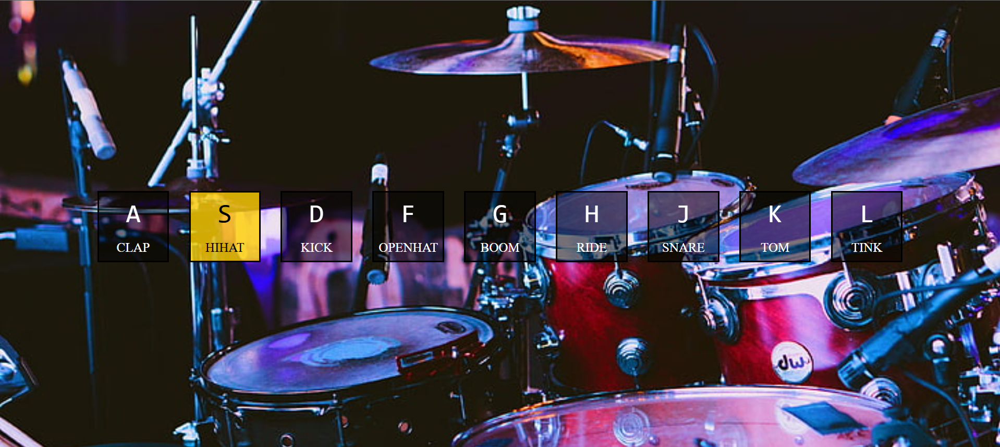

# 🥁 JavaScript Drum Kit

A simple and fun interactive drum kit built using **Vanilla JavaScript**. Press the keys on your keyboard to play different drum sounds and create your own beats!



---

## 🎮 How to Use

Press the following keys to play drum sounds:

| Key | Sound      |
|-----|------------|
| A   | Clap       |
| S   | Hi-Hat     |
| D   | Kick       |
| F   | Open Hat   |
| G   | Boom       |
| H   | Ride       |
| J   | Snare      |
| K   | Tom        |
| L   | Tink       |

---

## 🛠️ Setup Instructions

1. **Clone the Repository**  
   ```bash
   git clone https://github.com/your-username/javascript-drum-kit.git
   cd javascript-drum-kit
